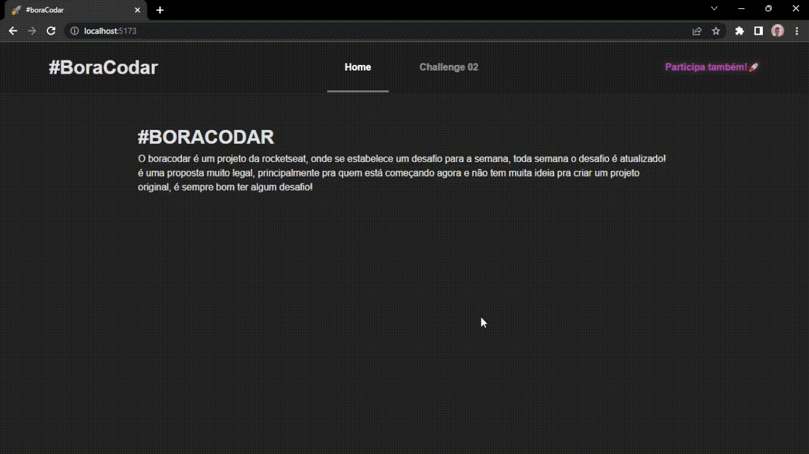

# BORACODAR!!!! 

Opa galera, esse projeto é bem inspirado em um que eu ví no linkedin 😁 claro que não está tão legal quanto [esse aqui](https://www.linkedin.com/feed/update/urn:li:activity:7018979487241396224?updateEntityUrn=urn%3Ali%3Afs_feedUpdate%3A%28V2%2Curn%3Ali%3Aactivity%3A7018979487241396224%29) kkkk mas basicamente é um projeto que vai conter os desafios que eu fizer do [#boracodar](https://boracodar.dev/) da nossa querida [rocketseat](https://www.rocketseat.com.br/)! 

Eu perdi o primeiro desafio, mas ainda vou fazer 🤩

Por enquanto as tecnologias que eu usei foram: 

* react ⚛
* Styled Components 💅

Estou aprendendo essas tecnologias, e ví nesse projeto uma oportunidade de praticar coisas novas, e me desafiar cada vez mais! 

Aqui tem um pequeno vídeo de como ele está: 

